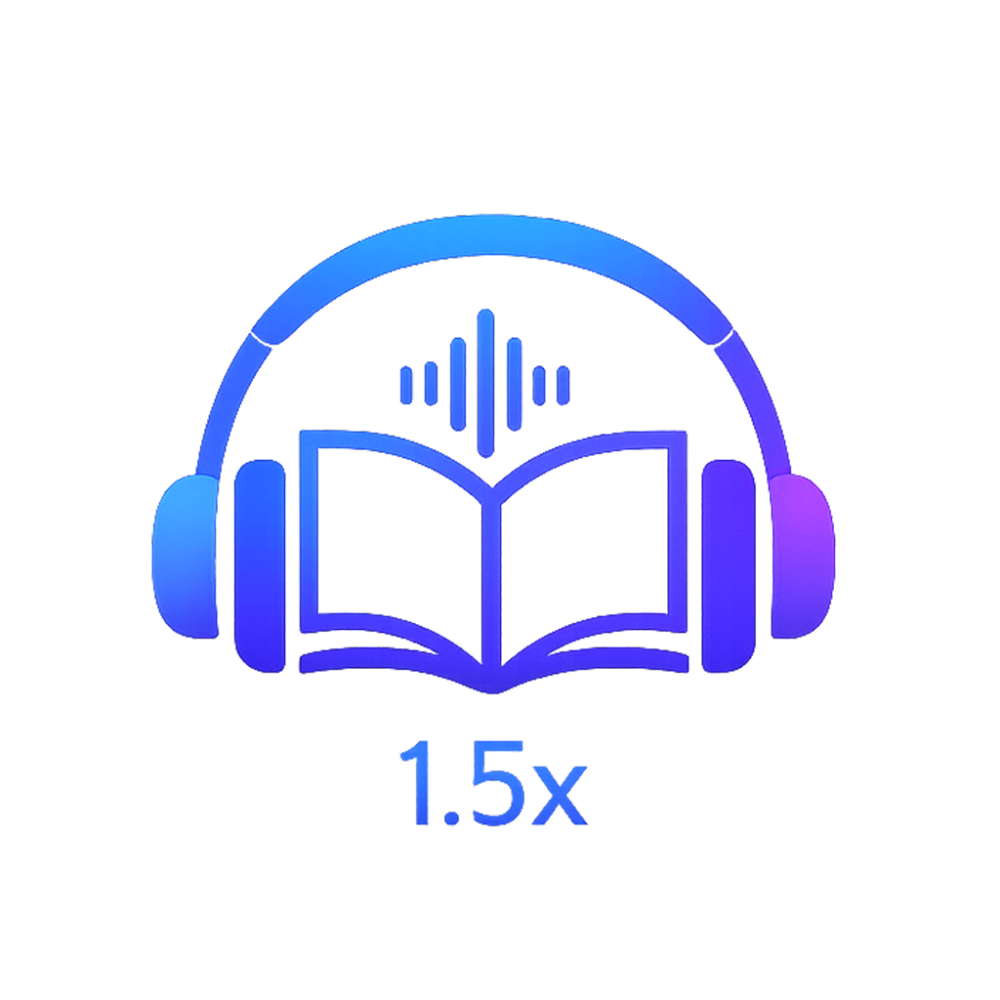

# Mono - 听书播放器



一个简洁的跨平台有声书播放器，支持 iOS 和 Android。专为听书场景设计，简单易用。

## 功能特性

- **文件导入**：通过电脑将音频文件夹传输到手机
- **二级目录**：文件夹 → 音频文件，按文件名自然排序
- **倍速播放**：0.5x ~ 3.0x，自动记住选择
- **断点续播**：退出后自动保存进度，启动时恢复
- **后台播放**：锁屏控制、通知栏/控制中心播放
- **删除管理**：iOS 滑动删除，Android 长按删除

## 项目结构

```
Mono/
├── MonoiOS/                 # iOS 版本
│   ├── Mono/                # 源代码
│   └── Mono.xcodeproj/      # Xcode 项目
│
├── MonoAndroid/             # Android 版本
│   ├── app/                 # 源代码
│   └── build.gradle.kts     # Gradle 配置
│
└── UIRes/                   # 共享资源
    └── mono_icon.png        # 应用图标
```

## 技术栈

| 平台 | 语言 | UI 框架 | 音频 | 存储 |
|------|------|---------|------|------|
| iOS | Swift | UIKit | AVPlayer | UserDefaults |
| Android | Kotlin | Jetpack Compose | ExoPlayer | SharedPreferences |

## 快速开始

### iOS

1. 用 Xcode 打开 `MonoiOS/Mono.xcodeproj`
2. 连接 iPhone，选择目标设备
3. 点击 Run 运行

**导入音频：**
- 连接 iPhone 到 Mac
- 打开 Finder → 选择设备 → 文件 → Mono
- 将音频**文件夹**拖入

### Android

1. 用 Android Studio 打开 `MonoAndroid/` 目录
2. 等待 Gradle 同步完成
3. 连接 Android 设备，点击 Run 运行

**导入音频：**
- 将音频文件夹复制到手机的 `Music/Mono/` 目录
- 可通过 USB 文件传输或文件管理器操作

## 目录结构要求

```
# iOS - Documents/
书籍A/
├── 01.第一章.mp3
├── 02.第二章.mp3
└── 03.第三章.mp3

# Android - Music/Mono/
书籍A/
├── 01.第一章.mp3
├── 02.第二章.mp3
└── 03.第三章.mp3
```

**支持格式：** mp3, m4a, m4b, wav, aac, flac, ogg (Android), wma (Android)

## 架构说明

### iOS 架构

```
Mono/
├── Models/          # 数据模型
├── Services/        # 业务逻辑
│   ├── AudioPlayerManager    # 播放控制（单例）
│   ├── FileService           # 文件管理（单例）
│   └── PlaybackStateManager  # 状态持久化（单例）
├── Views/           # 界面
│   ├── FolderListViewController
│   ├── TrackListViewController
│   ├── PlayerViewController
│   └── MiniPlayerView
└── Extensions/      # 扩展
```

### Android 架构

```
com.mono/
├── data/
│   ├── model/       # 数据类
│   ├── repository/  # 文件操作
│   └── preferences/ # 持久化
├── player/          # 播放服务
│   └── AudioPlaybackService  # ExoPlayer + 前台服务
└── ui/
    ├── screens/     # 页面
    ├── components/  # 组件
    └── theme/       # 主题
```

## 开发指南

### 添加新功能

1. **播放相关**
   - iOS: `Services/AudioPlayerManager.swift`
   - Android: `player/AudioPlaybackService.kt`

2. **文件操作**
   - iOS: `Services/FileService.swift`
   - Android: `data/repository/FileRepository.kt`

3. **持久化**
   - iOS: `Services/PlaybackStateManager.swift`
   - Android: `data/preferences/PreferencesManager.kt`

4. **UI 界面**
   - iOS: `Views/` 目录
   - Android: `ui/screens/` 目录

### 代码规范

- iOS: UIKit 纯代码，无 Storyboard
- Android: Jetpack Compose 声明式 UI
- 单例通过 `shared` (iOS) 或 `getInstance()` (Android) 访问

## 版本要求

- iOS: 15.0+
- Android: 8.0+ (API 26)

## License

MIT License

